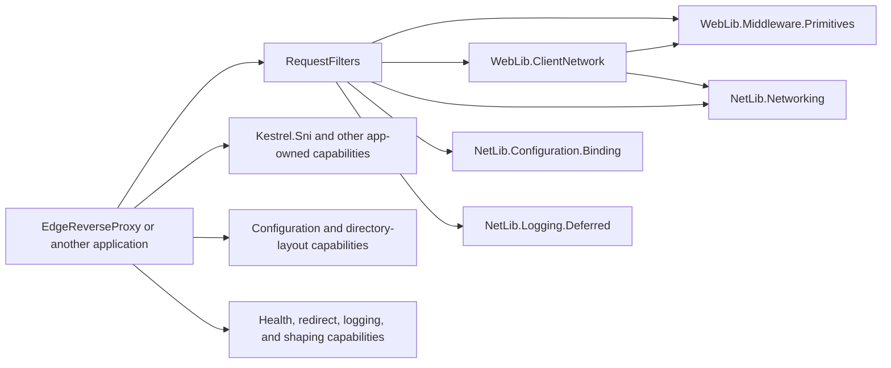

# RequestFilters capability-package migration mapping

## Status

Source-verified migration map for the implemented filter-only capability split. The migration described here has been
applied in `Eigenverft.Routed.RequestFilters` and verified on `net8.0` and `net10.0`; the compared sibling repositories
remain read-only reference inputs.

`Eigenverft.Web.EdgeReverseProxy` is the target-architecture reference. `Eigenverft.App.ReverseProxy` is treated only as
historical evidence of APIs consumed from older RequestFilters releases.

## Audit rule

The map answers two separate questions:

1. Does the retained RequestFilters implementation execute this functionality?
2. If not, which application-owned capability is related when a consumer migrates away from the old API?

Only an affirmative answer to the first question can create a RequestFilters package dependency. XML documentation,
examples, commented-out calls, similarly named APIs, and historical application usage do not establish an internal
dependency.

Mapping categories:

- **Core dependency**: retained filter code executes the capability; RequestFilters may reference the narrow package.
- **Retain internally**: the behavior is filter-specific and remains part of RequestFilters.
- **Consumer migration only**: remove the old API from RequestFilters; an application references the related package.
- **Remove**: no retained filter need and no package dependency is justified.

## Responsibility boundary

RequestFilters owns request classification, filter policies, filter decisions, filter events and evaluation, enforcement,
and tightly scoped operations over filter-owned state. A helper does not become RequestFilters-owned merely because an
old application obtained it from the package.

Application composition remains outside RequestFilters. This includes host construction, configuration-source setup,
Kestrel and certificates, directory layout, application logging setup, static files, warm-up, health probes, canonical
redirects, general traffic logging, and traffic shaping.

## Audit conclusion

The capability split is consumed selectively, not wholesale:

| Outcome in RequestFilters | Scope |
| --- | --- |
| Keep and replace local generic code with packages | `Eigenverft.WebLib.Middleware.Primitives`, `Eigenverft.WebLib.ClientNetwork`, `Eigenverft.NetLib.Networking`, `Eigenverft.NetLib.Configuration.Binding`, and `Eigenverft.NetLib.Logging.Deferred` |
| Keep inside RequestFilters | Filter policies, classification, decisions, events, evaluation/enforcement, filter-owned state, and the null/in-memory/SQLite event stores |
| Remove from RequestFilters without a replacement dependency | Host construction, Kestrel/SNI, certificates, directory layout, application configuration composition, startup logging, static files, warm-up, redirects, probes, HSTS, general traffic logging, and traffic shaping |

No sixth narrow Eigenverft package is justified by the retained source. In particular, SQLite event storage uses its own
configured path and BCL file APIs, so it does not require a directory-layout package. `BrowserBootstrapFiltering` uses
ASP.NET Core `IDataProtection` directly, so it does not require an Eigenverft security/data-protection package.

## Compared repository state

| Repository | Role in this audit | Branch | Commit |
| --- | --- | --- | --- |
| `Eigenverft.Routed.RequestFilters` | Package being reduced | `develop` | `bae9d6de66c713c49cdc83963627ea6ab7c9e22d` |
| `Eigenverft.Web.EdgeReverseProxy` | Current target application architecture | current checkout | Source and project files inspected read-only |
| `Eigenverft.App.ReverseProxy` | Historical consumer of the old package | current checkout | Source and project files inspected read-only |
| `Eigenverft.WebLib.Infrastructure` | Capability implementation inventory | `main` | `8ca50341119d2810c59a81cd69bdf1331a727b4c` |
| `Eigenverft.NetLib.Infrastructure` | Capability implementation inventory | `main` | `f55ec257b3db098e8b904690a7a16315a4ee9ff9` |

WebLib, NetLib, EdgeReverseProxy, and App.ReverseProxy are read-only inputs to this map.

## Correct target dependency graph

EdgeReverseProxy already references its host/application capabilities directly. RequestFilters must not sit between the
application and those capabilities.

There is deliberately no RequestFilters edge to Kestrel.Sni, Certificates, Hosting.DirectoryLayout,
Configuration.Sources, Configuration.Values, Configuration.SwitchableJson, Configuration.Sets, Logging.Bootstrap,
StaticFiles, SelfHttpWarmup, CanonicalHostRedirect, HealthProbes, Hsts, RequestTrafficLogging, or
RequestTrafficShaping.

## Packages justified by retained filter code

These are the only narrow Eigenverft package dependencies supported by the current source audit.

| Retained RequestFilters need | Narrow package | Executable source evidence | Migration meaning |
| --- | --- | --- | --- |
| Register shared middleware once, validate DI registrations, apply use-site options, write short-circuit responses, and store typed request markers | `Eigenverft.WebLib.Middleware.Primitives` | Retained filter registration extensions call `UseMiddlewareOnce(...)`, `EnsureServicesRegistered(...)`, and `CreateUseSiteOptionsMonitor(...)`; filter middleware calls `WriteHtmlStatusResponseAsync(...)`; `FilteringEvaluationGate` stores a typed request feature | The local generic implementations have been replaced. This package is used by filter code itself. |
| Resolve and expose the client address used by filters | `Eigenverft.WebLib.ClientNetwork` | Retained filters record or classify `IClientNetworkFeature.RemoteIpAddress`; only pipelines that need the address call `UseClientNetworkFeature()` | The private context middleware has been replaced. This is shared input to actual filter decisions. |
| Normalize addresses and match CIDR networks | `Eigenverft.NetLib.Networking` | `CidrFiltering` delegates network matching to `IPAddress.Matches(...)`; persisted/logged addresses and `DevelopmentUnlocker` overrides use `ToCanonicalString()` | Only networking primitives moved to the package. Filter policies remain in RequestFilters. The direct reference is intentional because retained code calls these APIs directly. |
| Preserve replacement-of-defaults semantics while binding filter option collections | `Eigenverft.NetLib.Configuration.Binding` | Retained filter options now use `List<T>` and the weighted evaluator uses `Dictionary<TKey,TValue>`; registrations call `BindReplacingCollectionDefaults(...)` with `UseCodeDefaults` | The wrapper collections have been removed. Non-empty configuration replaces defaults, while missing or explicitly empty collections retain code defaults, including after reload. |
| Lazy, level-aware logging inside filters and filter-event storage | `Eigenverft.NetLib.Logging.Deferred` | Retained filters, evaluators, and all filter-event storage implementations use `IDeferredLogger<T>` | Replace the local logger implementation and DI registration. This does not imply Serilog ownership inside RequestFilters. |

The existing `Microsoft.Data.Sqlite` and native SQLite dependencies remain while SQLite-backed filtering-event storage is
part of the library. They are not part of the WebLib/NetLib capability migration.

## Filter-specific functionality retained

The following behavior remains RequestFilters-owned:

| Capability | Decision |
| --- | --- |
| `AcceptLanguageFiltering` | Retain request classification and allow/deny policy. |
| `BrowserBootstrapFiltering` | Retain as a specialized request challenge/filter for selected entry routes. |
| `CidrFiltering` | Retain policy and events; replace only networking primitives. |
| `DevelopmentUnlocker` | Retain only as a narrowly scoped operation over filter-owned event state. |
| `FileExtensionBlocking` | Retain request-path denial policy; static-file serving is unrelated. |
| `FilteringEvaluationGate` and evaluators | Retain filter-event evaluation and enforcement. |
| `HostNameFiltering` | Retain its filter semantics; ASP.NET host filtering is only a possible consumer alternative for a simpler allow-list requirement. |
| `HttpMethodFiltering` | Retain. |
| `HttpProtocolFiltering` | Retain. |
| `PathDepthFiltering` | Retain. |
| `RemoteIpAddressFiltering` | Retain policy and events; consume the client-network feature. |
| `RequestSignatureFiltering` and `RequestSignatureBuilder` | Retain. |
| `RequestUrlFiltering` | Retain. |
| `TlsProtocolFiltering` | Retain request-level classification; it is not Kestrel TLS configuration. |
| `UriSegmentFiltering` | Retain. |
| `UserAgentFiltering` | Retain. |
| `FilterClassifier`, wildcard matching, decision logging, event models | Retain. Move wildcard matching out of `GenericExtensions` and keep it internal unless its public contract is intentionally preserved. |
| Null, in-memory, and SQLite filter-event storage | Retain for this migration. |

## Consumer migration only: generic, hosting, and utility APIs

Everything in this table leaves RequestFilters without adding the related package to RequestFilters. The package is
referenced by an application only when that application uses the capability.

| Old RequestFilters area | Related owner outside RequestFilters | Audit result and required action |
| --- | --- | --- |
| `ConfigureKestrelSni(...)`, `ConfigureKestrelSniFromConfiguration(...)`, `CertificateManager` | `Eigenverft.WebLib.Kestrel.Sni`; certificate mechanics are owned by `Eigenverft.NetLib.Security.Certificates` | Consumer migration only. No retained filter executes this code. App.ReverseProxy historically calls it; EdgeReverseProxy already directly references and calls WebLib.Kestrel.Sni. Delete it from RequestFilters and add no corresponding dependency. |
| `WebApplicationBuilderFactory`, builder directory-layout attachment, `AppDirectoryLayout` | `Eigenverft.WebLib.Hosting.DirectoryLayout` and its NetLib dependency | Consumer migration only. EdgeReverseProxy already uses the extracted web factory directly. |
| `AddDefaultConfigurationSources(...)` | `Eigenverft.NetLib.Configuration.Sources` | Consumer migration only. This configures an application host, not a filter. EdgeReverseProxy already references Configuration.Sources directly. |
| Encoded settings, DPAPI/Base64 codecs, JSON encoding, and `AddEncodedSettingsLayer(...)` | Primarily `Eigenverft.NetLib.Configuration.Values`, `SwitchableJson`, and optionally `Sets`/`Transformations` | Consumer migration only and not one-to-one. EdgeReverseProxy composes the narrow configuration packages directly. RequestFilters must not reference them. |
| Configuration precedence/collision diagnostics | `Eigenverft.NetLib.Configuration.Diagnostics` | Consumer migration only. EdgeReverseProxy references this package directly. |
| `BootstrapLogger` | `Eigenverft.NetLib.Logging.Bootstrap` | Consumer migration only. Application startup owns bootstrap logging; EdgeReverseProxy already references it directly. |
| Serilog `ToMicrosoftILogger<T>()` and Serilog `ToDeferred<T>()` bridges | Application logging composition; then `Eigenverft.NetLib.Logging.Deferred` over Microsoft logging | Remove from RequestFilters. A consumer may configure Serilog, but RequestFilters receives Microsoft/deferred loggers through DI. |
| `AddAllowedHosts(...)` | ASP.NET Core host filtering | Consumer migration only. App.ReverseProxy and other historical consumers call it; no retained RequestFilters code does. |
| `AddPermanentHttpsRedirection(...)` | Native `AddHttpsRedirection(...)`, or app-owned `Eigenverft.WebLib.CanonicalHostRedirect` when combined canonicalization is intended | Consumer migration only. `Eigenverft.WebLib.Hsts` is not a redirect replacement. |
| `UseNonAssetFiles(...)`, PWA/Blazor MIME mappings, and static-file mounting | `Eigenverft.WebLib.StaticFiles`, optionally `Eigenverft.WebLib.Middleware.Primitives` pipeline helpers, and native static-file middleware | Consumer migration only. These are used by web applications, not retained filters. |
| `WarmUpRequests` | `Eigenverft.NetLib.Hosting.SelfHttpWarmup` | No active App.ReverseProxy call exists; the observed call is commented out. Remove from RequestFilters. A current application may opt into the package directly if warm-up is actually required. |
| `WritebackJsonStore<T>` | `Eigenverft.NetLib.Configuration.WritebackJson` | No executable use by retained filter code and no active use found in the inspected current consumers. Remove from RequestFilters; this package is relevant only to a future consumer that needs writeback. |
| Process-path and writable-directory helpers | Application-owned DirectoryLayout capability or BCL APIs | Remove. They are used only by non-filter hosting/storage helpers inside the current package and create no RequestFilters dependency. |
| General `HttpContext.Items` helper API | Prefer typed `HttpContext.Features`; `Eigenverft.WebLib.Middleware.Primitives` supplies feature helpers | Do not retain the public generic API. Only the filter-owned evaluation marker and client-network state require internal migration. |

## Consumer migration only: non-filter middleware

| Old RequestFilters middleware | Application-owned capability | Important semantic difference |
| --- | --- | --- |
| `CanonicalHostRedirect` | `Eigenverft.WebLib.CanonicalHostRedirect` | EdgeReverseProxy already references and invokes the package directly. The target uses its own section/options and canonical HTTPS 308 behavior. No RequestFilters dependency. |
| `HealthProbeFaviconAware` | `Eigenverft.WebLib.HealthProbes` | EdgeReverseProxy already references and invokes the package directly. The extracted helper is intentionally narrower than the old configurable middleware. |
| `RequestLogging` | `Eigenverft.WebLib.RequestTrafficLogging` | EdgeReverseProxy already references and invokes the package directly. It is a redesign around ASP.NET HTTP Logging, not a contract-compatible rename. |
| `RequestDelayThrottling` | Closest capability: `Eigenverft.WebLib.RequestTrafficShaping` | No active call was found in App.ReverseProxy. Native token buckets/queues are not equivalent to progressive sleeps. Remove from RequestFilters; migrate only a consumer that still requires the scenario. |
| `RequestRateSmoothing` | Closest capability: `Eigenverft.WebLib.RequestTrafficShaping` | App.ReverseProxy historically invokes it; EdgeReverseProxy directly owns RequestTrafficShaping. Token buckets, queues, and concurrency limits do not preserve the old delay-step/hysteresis algorithm. |

`RemoteIpAddressContext` is intentionally absent from this table. Although it is generic infrastructure, retained filter
code needs its result, so it is an internal replacement through WebLib.ClientNetwork rather than an application-only
migration.

## Dependency cleanup implied by the split

After the consumer-only source is removed and retained code uses the five justified packages:

- remove `CommunityToolkit.Diagnostics`; its observed calls are limited to encoded settings and Kestrel SNI code;
- remove direct `Serilog` and `Serilog.Extensions.Logging`; their observed use is limited to the application logging bridges;
- remove `System.Security.Cryptography.ProtectedData`; its observed use is limited to encoded settings;
- retain the SQLite packages while SQLite filter-event storage remains;
- reference neither WebLib nor NetLib aggregate packages.

## Resolved compatibility gate

RequestFilters now targets `net8.0` and `net10.0`, matching all five justified narrow capability packages. The former
`net6.0` and `net7.0` targets were removed as a documented breaking pre-1.0 change; no conditional legacy
implementations remain. This decision did not introduce any application-owned package.

## Implemented migration order

1. Remove consumer-only APIs and middleware from RequestFilters without adding their successor packages to RequestFilters.
   EdgeReverseProxy already demonstrates direct application ownership for most of these capabilities.
2. Align target frameworks or explicitly accept the conditional legacy path.
3. Add only the five narrow dependencies justified by retained filter code.
4. Replace middleware primitives, client-network context, CIDR/address utilities, option collection binding, and deferred
   logging inside retained filters.
5. Move filter wildcard matching into an internal filter-specific namespace and remove the remaining
   `GenericExtensions/` surface.
6. Remove now-unused general-purpose package references and verify the final dependency graph.
7. Document application migration separately where an old consumer still calls a removed API; that documentation must not
   turn the successor package into a RequestFilters dependency.
8. Add compatibility tests for every retained filter, filter-event/evaluation flow, client-address behavior, CIDR matching,
   collection binding, short-circuit responses, and wildcard matching.

## Definition of done

- RequestFilters contains only filter-specific behavior and filter-owned state operations.
- No source remains under `GenericExtensions/`.
- RequestFilters references only the five justified narrow Eigenverft capability packages, plus its actual non-Eigenverft
  runtime dependencies such as SQLite.
- RequestFilters has no dependency on Kestrel.Sni, Certificates, DirectoryLayout, application configuration packages,
  Bootstrap logging, StaticFiles, SelfHttpWarmup, redirects, health probes, HSTS, general request logging, or traffic shaping.
- Consumers reference application capabilities directly; RequestFilters exposes no forwarding facade.
- Public removals and non-equivalent consumer migrations are documented as breaking changes.
- Builds and tests cover every retained target framework, and the resolved graph contains no broad aggregate package.
